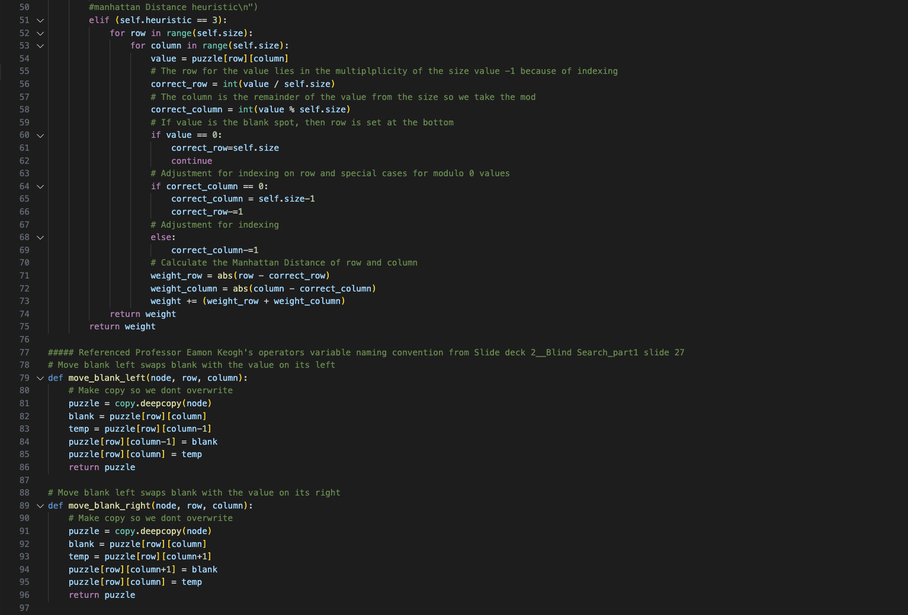
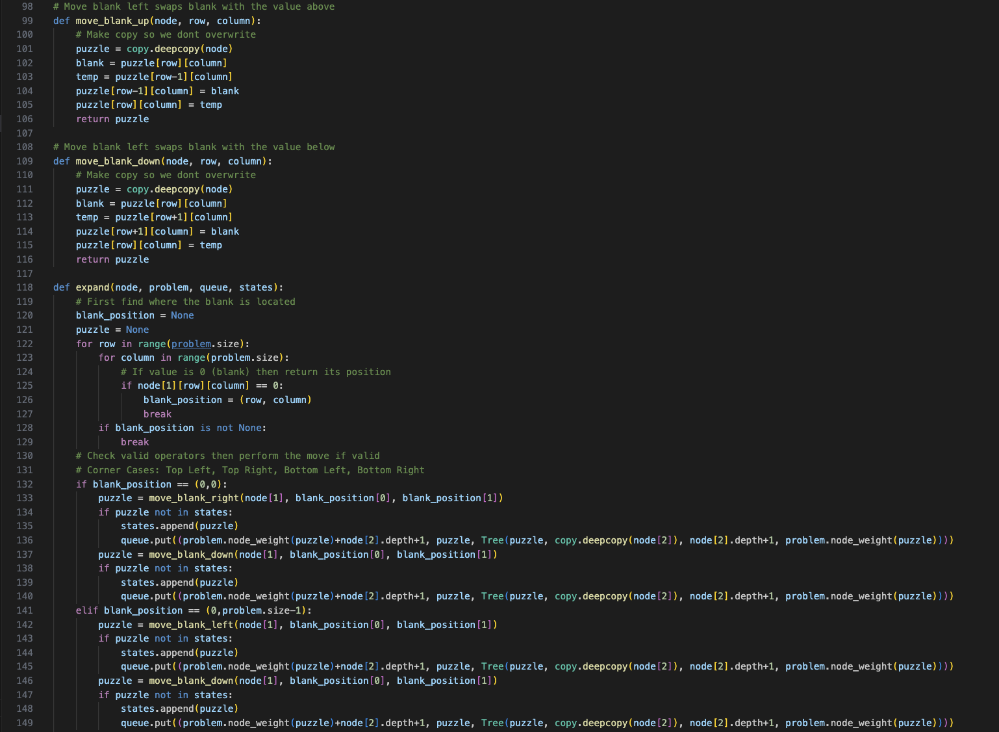
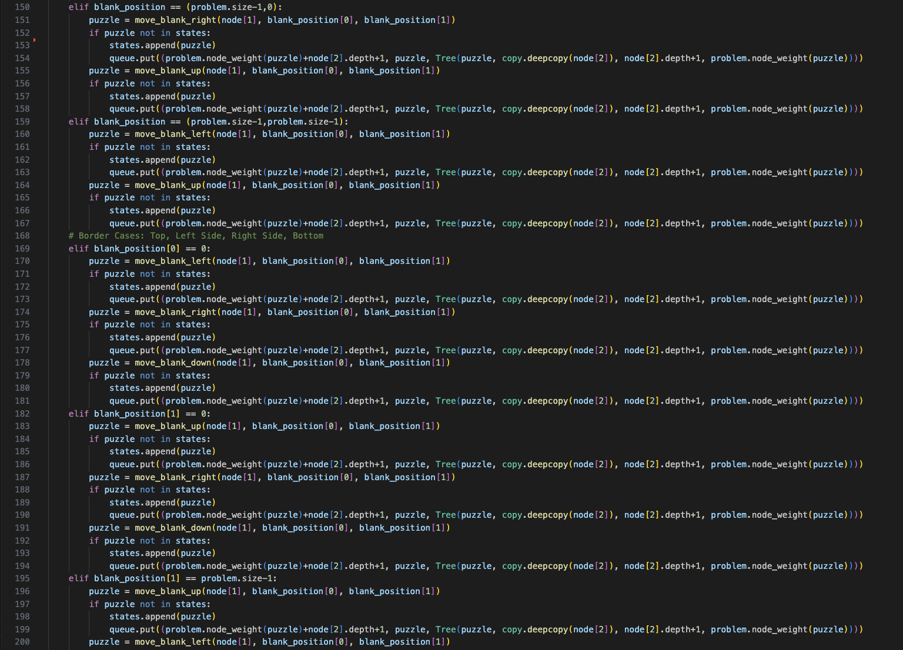
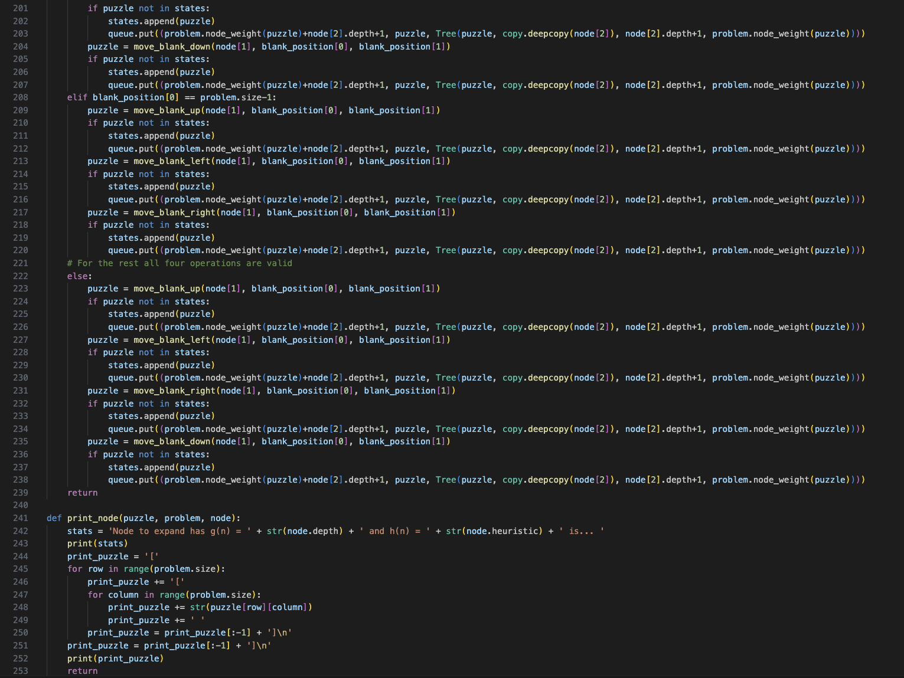
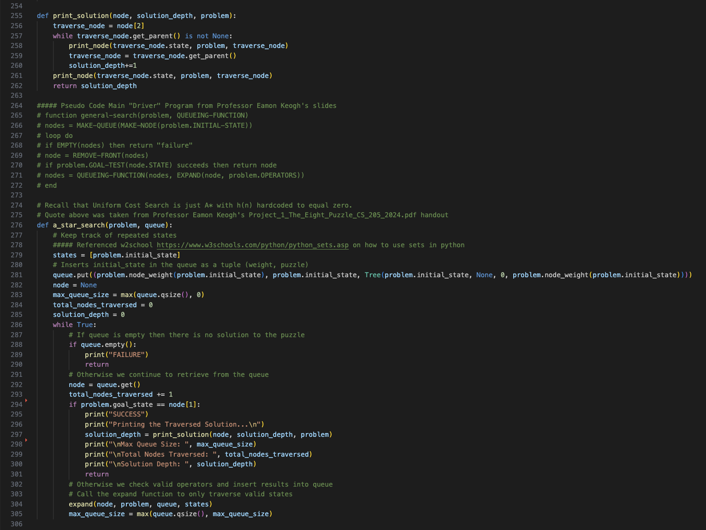
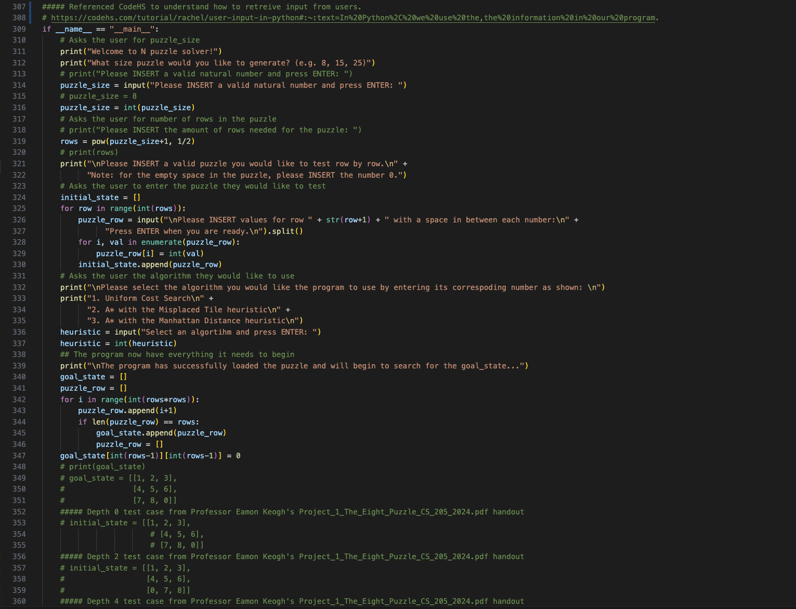
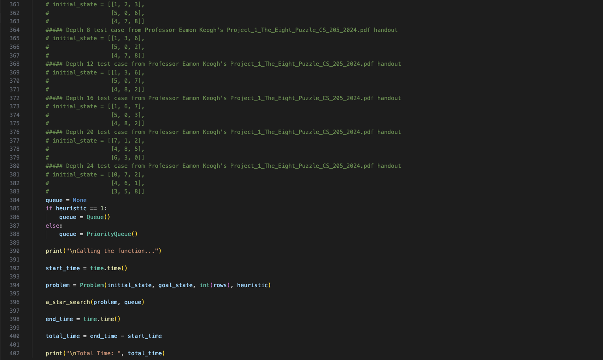

# Project 1: The Eight Puzzle

Name:   Shaoyu Tu\
SID:    862137500\
Email:  stu024@ucr.edu\
Date:   May 03, 2024\
[Github Link](https://github.com/Kevin20201/CS_205) (https://github.com/Kevin20201/CS_205)

The following report's format takes inspiration from Dr. Eamonn Keogh's example report. [[ 1 ]](#1).

Below is a list of links and short description attached that I consulted in order to complete this project.

- StackOverflow for creating citation links in markdown:  https://stackoverflow.com/questions/26587527/cite-a-paper-using-github-markdown-syntax
- CodeHS to understand how to retreive input from users cli: https://codehs.com/tutorial/rachel/user-input-in-python#:~:text=In%20Python%2C%20we%20use%20the,the%20information%20in%20our%20program
- Geeks for Geeks on how to call deepcopy(): https://www.geeksforgeeks.org/copy-python-deep-copy-shallow-copy/
- The Python Standard Library for understanding the use of its built-in Queue data structure: https://docs.python.org/3/library/queue.html
- StackOverflow to understand how to create a generic tree node class: https://stackoverflow.com/questions/2482602/a-general-tree-implementation
- The Python Tutorial to understand how to write a problem class: https://docs.python.org/3/tutorial/classes.html
- Professor Eamon Keogh's slide deck 3__Heuristic Search 2 slide 4 for setting heuristic values
- Professor Eamon Keogh's operators variable naming convention from Slide deck 2__Blind Search_part1 slide 27

All major parts in solving the 8-puzzle code is original. Subroutines borrowed from Python libraries includes...

- Subroutines from `copy`: `deepcopy()` function is used to distinguish between copy by value from the standard copy by reference.
- Subroutines from `queue`: `Queue()` and `PriorityQueue()` classes are used to handle the different A* heuristics. Functions such as `empty()`, `get()`, and `qsize()` were used to check the queue status.

"*I affirm that I did not use ChatGPT or similar to write the code or text in this work.*" [[ 1 ]](#1)

## Contents

- [Project 1: The Eight Puzzle](#project-1-the-eight-puzzle)
  - [Contents](#contents)
  - [Objective](#objective)
  - [Algorithm](#algorithm)
    - [Uniform Cost Search](#uniform-cost-search)
    - [A\* Search with Misplaced Tile Heuristic](#a-search-with-misplaced-tile-heuristic)
    - [A\* Search with Manhattan Distance Heuristic](#a-search-with-manhattan-distance-heuristic)
  - [Evaluation](#evaluation)
    - [Nodes Traversed vs Depth](#nodes-traversed-vs-depth)
    - [Max Queue Size vs Depth](#max-queue-size-vs-depth)
  - [Final Thoughts](#final-thoughts)
  - [Trace](#trace)
  - [Implementation](#implementation)
  - [References](#references)

## Objective
This project aims to solve the 8-puzzle, a sliding puzzle, with heuristic search. Specifically, our objective is to implement the Uniform Cost Search and A* Search to then evaluate their performance.

The sliding puzzle comes in a variety of sizes such as 4x4, 5x5, 6x6, and etc. But to make the explanation simple, our focus for this report will just be on the 3x3 or 8-puzzle. The 8-puzzle, similar to most other puzzles can be broken down into a simple search problem. 

Below we have defined our problem space.
- The representation of a state is having 8 tiles in a locked position such that there is one empty tile at any given time.
- The initial state is setting up the board such that there are 8 tiles with a distinct empty tile in the 3x3 grid.
- The operators that are acceptable in our case is to think of the puzzle as moving the empty tile. Therefore, the legal moves for the empty tile is at most 4 distinct moves (up, down, left, or right) provided its current position on the board.
- The goal state is to have the tiles end up in ascending order such that for the 8-puzzle, we would have values 1, 2, and 3 on top row, 4, 5, and 6 in the middle row, and lastly 7, 8, and the empty tile be on the last row.

## Algorithm
For our implementation, we were asked to implement 3 algorithms for our 8-puzzle, the Uniform Cost Search, the A* Search with the Misplaced Tile heuristic, and the A* Search with the Manhattan Distance heuristic.

### Uniform Cost Search
We were provided a reminder in the project description that the "Uniform Cost Search is [simply] the A* search [provided a heuristic function] hard coded to zero" [[ 1 ]](#1). Therefore, the Uniform Cost Search in implementation for this problem is also equivalent to running Breadth First Search. The order for travering the node is simply the cost function, g(n), which is set to the depth of the node. Thus, the algorithm will just search depth by depth providing a solution that is both optimal and complete.

### A* Search with Misplaced Tile Heuristic
For our first useful heuristic, we implement the misplaced tile heuristic. As its name suggests, this heuristic simply returns a count equal to the number of tiles misplaced when compared to the goal state excluding the empty tile. The cost function for this algorithm is still the depth of the tree which is equal to how many steps it has already taken from the initial state.

### A* Search with Manhattan Distance Heuristic
For this final heuristic, we implement the manhattan distance heuristic. The Manhattan Distance heuristic acts similar to the Misplaced Tile heuristic in that it accounts for all tiles misplaced when compared to the goal state. But instead of a simple incremented count, the Manhattan Distance heuristic counts how far away the tile is currently from its destination while restricting its movement to a 2d space (up, down, left and right).

## Evaluation
We were given a set of puzzles to test our implementation along with their optimal solution depth and below are results from these test cases with optimal solutions at depth, 0, 2, 4, 8, 12, 16, 20, and 24.

The first graph we will look at is Figure 1 as shown below. There are a few things we can take away from this graph. We first notice that puzzles with depth 8 or shallower have similar count of nodes expanded between all 3 algorithms. However, in the case of Uniform Cost search where no heuristic function exists, this depth rapidly grows to as much as 50 times larger when compared to the best performing algorithm, the A* with Manhattan Distance heuristic search. Lastly, we also see that with the additional heuristic functions in A*, the total nodes expanded is similar between the two algorithms.
### Nodes Traversed vs Depth
<!--  -->
<!--  -->
\
Figure 1: *A graph showcasing the number of nodes traversed as solution depth grows.*

Figure 2 shows the relationship between max queue size and solution depth from the puzzles. Similar to Figure 1, we see trends of the differences being negligible for puzzles that have solution of depth 8 or shallower. Then we see this rapid growth in the queue size for Uniform Cost search as the depth of the solution increases. For the relationship between max queue size and depth the difference is over 17 times between Uniform Cost search, the largest, and A* with Manhattan Distance heuristic search, the smallest, when comparing solution depth at 24. Finally, we also notice that the difference between the two A* search algorithms have similar proportional differences between the two figures at each test case.

### Max Queue Size vs Depth
<!--  -->
\
Figure 2: *A graph showcasing the maximum queue size as solution depth grows.*

## Final Thoughts

It was shocking to see what a drastic difference it makes when a useful heuristic function was chosen for A* over not having one at all. These heuristic functions that we tried are so simple in its idea giving an estimate to how many more moves we think it would take to solve the puzzle. Even with its simplicity, we are still able to capture a massive improvement over not having one.

The order from best performing to worst given the 3 algorithms we implemented ranks as follows: A* Search with the Manhattan Distance heuristic, A* Search with the Misplaced Tile heuristic, and Uniform Cost Search or in our project being equivalent to Breadth First Search and A* with heuristic function outputting the value 0.

These test cases with optimal solutions ranging from 0 to 24 shows us that given puzzles with shallow solution depths (8 or less) the algorithm of choice is not so important. But when it comes to searching for solutions at for example depth 20, choosing the A* with a useful heuristic becomes imperative.

## Trace

The following is a traceback for a puzzle of depth 4 with Manhattan Distance Heuristic.
```python
❯ python3 8_puzzle.py
Welcome to N puzzle solver!
What size puzzle would you like to generate? (e.g. 8, 15, 25)
Please INSERT a valid natural number and press ENTER: 8

Please INSERT a valid puzzle you would like to test row by row.
Note: for the empty space in the puzzle, please INSERT the number 0.

Please INSERT values for row 1 with a space in between each number:
Press ENTER when you are ready.
1 2 3

Please INSERT values for row 2 with a space in between each number:
Press ENTER when you are ready.
5 0 6

Please INSERT values for row 3 with a space in between each number:
Press ENTER when you are ready.
4 7 8 

Please select the algorithm you would like the program to use by entering its correspoding number as shown: 

1. Uniform Cost Search
2. A* with the Misplaced Tile heuristic
3. A* with the Manhattan Distance heuristic

Select an algortihm and press ENTER: 3

The program has successfully loaded the puzzle and will begin to search for the goal_state...

Calling the function...
SUCCESS
Printing the Traversed Solution...

Node to expand has g(n) = 4 and h(n) = 0 is... 
[[1 2 3]
[4 5 6]
[7 8 0]]

Node to expand has g(n) = 3 and h(n) = 1 is... 
[[1 2 3]
[4 5 6]
[7 0 8]]

Node to expand has g(n) = 2 and h(n) = 2 is... 
[[1 2 3]
[4 5 6]
[0 7 8]]

Node to expand has g(n) = 1 and h(n) = 3 is... 
[[1 2 3]
[0 5 6]
[4 7 8]]

Node to expand has g(n) = 0 and h(n) = 4 is... 
[[1 2 3]
[5 0 6]
[4 7 8]]


Max Queue Size:  6

Total Nodes Traversed:  5

Solution Depth:  4
```

The following is a traceback for a puzzle of depth 16 with Misplaced Tile Heuristic.
```python
❯ python3 8_puzzle.py
Welcome to N puzzle solver!
What size puzzle would you like to generate? (e.g. 8, 15, 25)
Please INSERT a valid natural number and press ENTER: 8

Please INSERT a valid puzzle you would like to test row by row.
Note: for the empty space in the puzzle, please INSERT the number 0.

Please INSERT values for row 1 with a space in between each number:
Press ENTER when you are ready.
1 6 7

Please INSERT values for row 2 with a space in between each number:
Press ENTER when you are ready.
5 0 3

Please INSERT values for row 3 with a space in between each number:
Press ENTER when you are ready.
4 8 2

Please select the algorithm you would like the program to use by entering its correspoding number as shown: 

1. Uniform Cost Search
2. A* with the Misplaced Tile heuristic
3. A* with the Manhattan Distance heuristic

Select an algortihm and press ENTER: 2

The program has successfully loaded the puzzle and will begin to search for the goal_state...

Calling the function...
SUCCESS
Printing the Traversed Solution...

Node to expand has g(n) = 16 and h(n) = 0 is... 
[[1 2 3]
[4 5 6]
[7 8 0]]

Node to expand has g(n) = 15 and h(n) = 1 is... 
[[1 2 3]
[4 5 6]
[7 0 8]]

... # Removed traces to shorten the print

Node to expand has g(n) = 2 and h(n) = 6 is... 
[[1 6 0]
[5 3 7]
[4 8 2]]

Node to expand has g(n) = 1 and h(n) = 6 is... 
[[1 6 7]
[5 3 0]
[4 8 2]]

Node to expand has g(n) = 0 and h(n) = 6 is... 
[[1 6 7]
[5 0 3]
[4 8 2]]


Max Queue Size:  301

Total Nodes Traversed:  489

Solution Depth:  16
```

The following is a traceback for a 15-puzzle of depth 2 with Manhattan Distance Heuristic to show that the implementation is also generalized to allow puzzle of different input sizes.
```python
❯ python3 8_puzzle.py
Welcome to N puzzle solver!
What size puzzle would you like to generate? (e.g. 8, 15, 25)
Please INSERT a valid natural number and press ENTER: 15

Please INSERT a valid puzzle you would like to test row by row.
Note: for the empty space in the puzzle, please INSERT the number 0.

Please INSERT values for row 1 with a space in between each number:
Press ENTER when you are ready.
1 2 3 4

Please INSERT values for row 2 with a space in between each number:
Press ENTER when you are ready.
5 6 7 8

Please INSERT values for row 3 with a space in between each number:
Press ENTER when you are ready.
9 10 11 12

Please INSERT values for row 4 with a space in between each number:
Press ENTER when you are ready.
13 0 14 15

Please select the algorithm you would like the program to use by entering its correspoding number as shown: 

1. Uniform Cost Search
2. A* with the Misplaced Tile heuristic
3. A* with the Manhattan Distance heuristic

Select an algortihm and press ENTER: 3

The program has successfully loaded the puzzle and will begin to search for the goal_state...

Calling the function...
SUCCESS
Printing the Traversed Solution...

Node to expand has g(n) = 2 and h(n) = 0 is... 
[[1 2 3 4]
[5 6 7 8]
[9 10 11 12]
[13 14 15 0]]

Node to expand has g(n) = 1 and h(n) = 1 is... 
[[1 2 3 4]
[5 6 7 8]
[9 10 11 12]
[13 14 0 15]]

Node to expand has g(n) = 0 and h(n) = 2 is... 
[[1 2 3 4]
[5 6 7 8]
[9 10 11 12]
[13 0 14 15]]


Max Queue Size:  4

Total Nodes Traversed:  3

Solution Depth:  2
```

## Implementation
[Github Link](https://github.com/Kevin20201/CS_205) (https://github.com/Kevin20201/CS_205)

**8_puzzle.py**










## References
<a id="1">[1]</a> 
Project 1 direction file: https://www.dropbox.com/scl/fi/ntcwot5x8zihrtqot0ysi/Project_1_The_Eight_Puzzle_CS_205_2024.pdf?rlkey=wvosnvls0lkgpiv7h5xsoicz8&e=1&dl=0